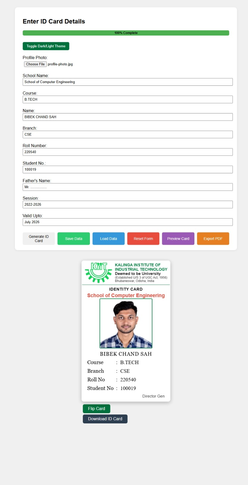

# KIIT Digital ID Card Builder

## Table of Contents
- [Overview](#overview)
- [Features](#features)
- [Preview](#preview)
- [Setup Instructions](#setup-instructions)
- [Installation](#installation)
- [Configuration](#configuration)
- [Usage Guide](#usage-guide)
- [Usage Examples](#usage-examples)
- [Troubleshooting](#troubleshooting)
- [FAQs](#faqs)
- [Contributing](#contributing)
- [Changelog](#changelog)
- [Acknowledgments](#acknowledgments)
- [Contact Information](#contact-information)
- [License](#license)

## Overview
The KIIT Digital ID Card Builder is a web application that allows users to generate digital ID cards for students. It provides a user-friendly interface to input student details, upload a profile photo, and generate a printable ID card in PDF format.

## Features
- **Form Input:** Enter student details such as name, course, branch, roll number, etc.
- **Profile Photo Upload:** Upload a profile photo to be displayed on the ID card.
- **Preview Mode:** Preview the ID card before generating the final version.
- **Progress Indicator:** Track form completion with a progress bar.
- **Save/Load Data:** Save entered data to localStorage and load it later.
- **Reset Form:** Clear all entered data and reset the form.
- **PDF Export:** Export the ID card as a PDF for printing.
- **Dark/Light Theme Toggle:** Switch between dark and light themes for better user experience.
- **Barcode Generation:** Generate a barcode for the student's roll number.

## Preview
### Screenshots

*ID Card Preview*

### GIF Demo

*ID Card Builder Demo*

## Setup Instructions
1. **Clone the Repository:**
   ```bash
   git clone https://github.com/bebedudu/kiit-id-card-generator
   cd kiit-id-card-builder
   ```

2. **Open the Project:**
   - Open the `index.html` file in your web browser to start using the application.

3. **Dependencies:**
   - The project uses the following external libraries:
     - [html2canvas](https://html2canvas.hertzen.com/) for capturing the card as an image.
     - [jsPDF](https://cdnjs.cloudflare.com/ajax/libs/jspdf/2.5.1/jspdf.umd.min.js) for PDF generation.
     - [JsBarcode](https://github.com/lindell/JsBarcode) for barcode generation.

## Installation
- Ensure you have a modern web browser installed.
- No additional installation steps are required.

## Configuration
- The application can be configured by modifying the default values in the `script.js` file.

## Usage Guide
1. **Enter Student Details:**
   - Fill in the required fields in the form.
   - Upload a profile photo.

2. **Preview the ID Card:**
   - Click the "Generate ID Card" button to see how the ID card will look.

3. **Save Data:**
   - Click the "Save Data" button to store the entered data in the browser's localStorage.

4. **Load Data:**
   - Click the "Load Data" button to retrieve previously saved data.

5. **Reset Form:**
   - Click the "Reset Form" button to clear all entered data.

6. **Export to PDF:**
   - Click the "Export PDF" button to generate a PDF of the ID card.

7. **Toggle Theme:**
   - Use the "Toggle Dark/Light Theme" button to switch between dark and light themes.

## Usage Examples
- **Example 1:** Generate an ID card for a student named John Doe.
- **Example 2:** Save the ID card data and load it later.

## Troubleshooting
- **Issue:** The barcode is not showing in the PDF.
  - **Solution:** Ensure that the JsBarcode library is correctly included and that the roll number is valid.

## FAQs
- **Q:** Can I use this application offline?
  - **A:** Yes, the application works offline as it uses localStorage for data storage.

## Contributing
Contributions are welcome! Please feel free to submit a Pull Request.

## Changelog
- **Version 1.0.0:** Initial release.

## Acknowledgments
- Thanks to all contributors and the libraries used in this project.

## Contact Information
- For support, please contact [bibeksha48@gmail.com](mailto:bibeksha48@gmail.com).

## License
This project is licensed under the MIT License.